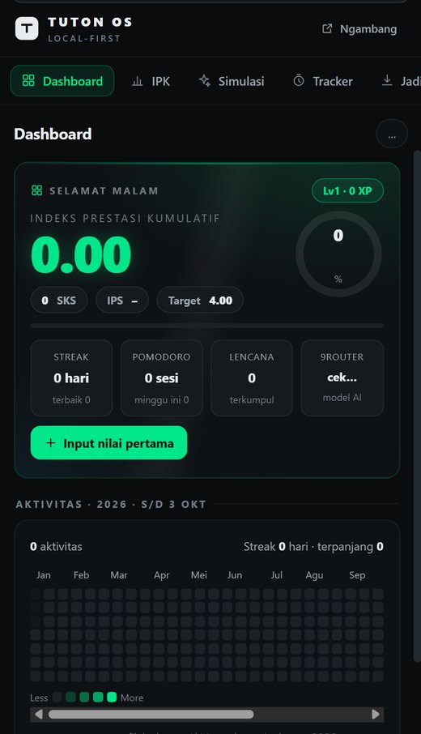
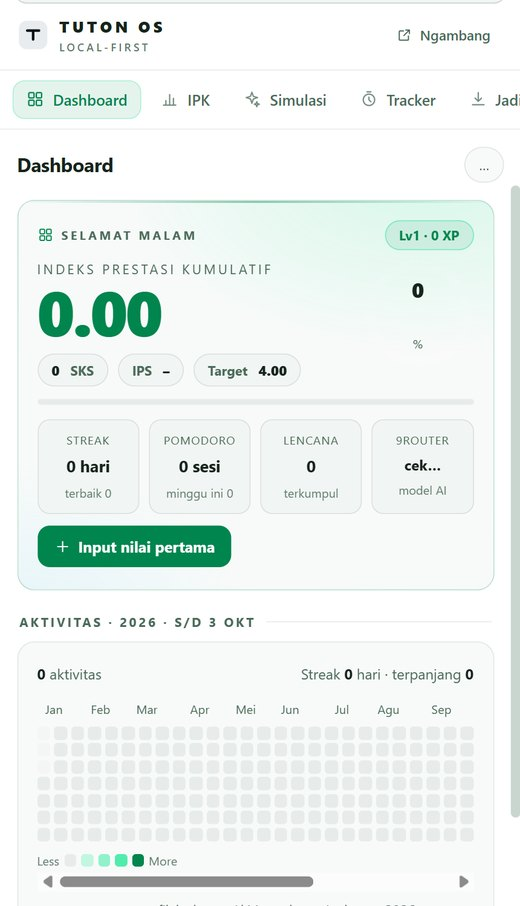
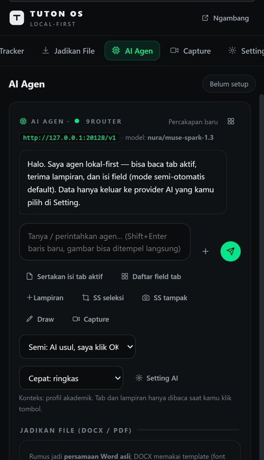
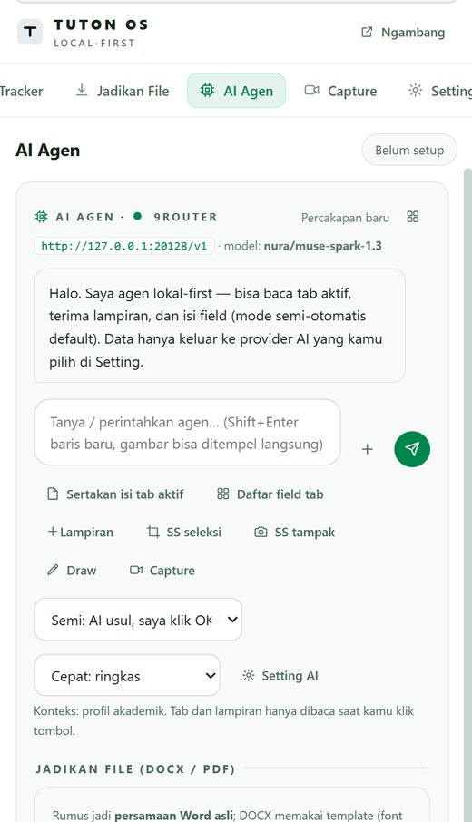

# Tuton OS

**Asisten akademik lokal-first untuk mahasiswa Universitas Terbuka (UT).**
Extension Chrome/Edge — gratis, opensource, datanya tinggal di perangkatmu.

[](https://github.com/fadilismee/tuton-os/releases)
[](LICENSE)
[](manifest.json)
[](#batasan)

Semua fitur inti jalan **tanpa server**: IPK, modul BMP, bank soal, alat PDF,
dan export jawaban jadi Word/PDF ber-rumus. Server lokal (opsional) hanya
dipakai untuk kerja berat: membaca PDF besar dan konversi Word → PDF.

> Dibuat oleh **[zerotime.web.id](https://zerotime.web.id)**

## Tampilan

| Tema Gelap (bawaan) | Tema Terang |
|---|---|
|  |  |
|  |  |

Perbandingan penuh: [`docs/screenshots/tema-gelap-terang.jpg`](docs/screenshots/tema-gelap-terang.jpg)

## Daftar isi

- [Unduh](#unduh)
- [Fitur](#fitur)
- [Cara pasang](#cara-pasang-2-menit)
- [Setting AI](#setting-ai-untuk-fitur-ai-agen)
- [Runtime lokal (opsional)](#runtime-lokal-opsional)
- [Tema & tampilan](#tema--tampilan)
- [Format dokumen jawaban](#format-dokumen-jawaban)
- [Isi repo](#isi-repo)
- [Storage & privasi](#storage--privasi)
- [Batasan](#batasan)
- [Pengembangan](#pengembangan)
- [Lisensi](#lisensi)

---

## Unduh

**[⬇️ tuton-os-v0.1.2.zip](https://github.com/fadilismee/tuton-os/releases/download/v0.1.2/tuton-os-v0.1.2.zip)**

Setelah unduh: **ekstrak** → `chrome://extensions` → nyalakan **Developer mode**
→ **Load unpacked** → pilih folder hasil ekstrak.

> Jangan men-drag file `.zip` langsung ke halaman `chrome://extensions` —
> itu tidak pernah diproses. Ekstrak dulu sampai kamu melihat `manifest.json`.

Semua versi ada di halaman [Releases](https://github.com/fadilismee/tuton-os/releases);
perubahan tiap versi di [CHANGELOG.md](CHANGELOG.md).

---

## Fitur

### AI Agen
Chat AI memakai API key milikmu sendiri (9router lokal, OpenAI, Anthropic, atau
gateway OpenAI-compatible apa pun). Bisa melampirkan teks, gambar, PDF modul,
dan screenshot; bisa juga membaca isi tab aktif. Jawaban disajikan dalam
markdown + rumus LaTeX yang siap diekspor.

### Jadikan File
Satu klik mengubah jawaban AI (atau materi yang kamu tempel) menjadi:

- **Word `.docx` ber-rumus asli** — persamaan OMML, bisa diedit di Word;
- **PDF** siap cetak (lewat Word/LibreOffice bila runtime hidup, atau halaman
  cetak A4 bawaan kalau tidak).

Kop mengikuti kebiasaan tugas tutor UT:
`JAWABAN Tugas 1 Sesi 3 - Bahasa Indonesia` + `Nama: … | NIM: …`,
dengan nama file mis. `jawaban tugas 1 sesi 3 - bahasa indonesia.docx`.
Kamu juga bisa langsung minta di chat: *"jadiin PDF"*, *"bikin docx"*.

### BMP Studio
Reader modul UT (`pustaka.ut.ac.id`) diambil halaman per halaman, dibaca dengan
OCR bahasa Indonesia, lalu dirakit menjadi **PDF searchable** yang tersimpan
lokal dan langsung terunduh.

### IPK & Simulasi
Kalkulator IPK skala UT (skema 30/70, 50/50, 60/40 praktik, TTM/Tuweb) plus
predikat, simulasi what-if, dan daftar "parasit IPK" — matkul yang paling
merusak IPK.

### Tracker & Fokus
Pomodoro, stopwatch, timer, check-in harian (streak), heatmap aktivitas, XP,
level, dan 7 lencana.

### Bank Soal
Paket soal terenkripsi lokal (AES-256-GCM), kuis, mode fokus, simulasi acak
30 soal, dan generate soal dari modul lewat AI.

### PDF Tools
7 alat lokal tanpa upload: gabung, pisah/ekstrak, hapus halaman, putar,
gambar → PDF, teks → PDF, dan kompres gambar.

### Capture & Rekam
Screenshot full-page/area, rekam tab/layar/webcam, menggambar di atas halaman,
dan kirim hasilnya ke AI.

---

## Cara pasang (2 menit)

1. Unduh **ZIP rilis** di atas (atau `git clone` repo ini) lalu ekstrak.
2. Buka Chrome/Edge → `chrome://extensions` (Edge: `edge://extensions`).
3. Nyalakan **Developer mode** (kanan atas).
4. Klik **Load unpacked** → pilih folder yang **langsung berisi `manifest.json`**.
5. Klik ikon Tuton OS di toolbar → **Buka Sidebar**.

Selesai. Fitur non-AI (IPK, tracker, PDF tools, BMP Studio, capture, export)
langsung bisa dipakai tanpa setting apa pun.

> **Sering salah di langkah 4:** kalau hasil ekstrak jadi folder bertingkat,
> masuk satu level dulu sampai kamu melihat `manifest.json`.

---

## Setting AI (untuk fitur AI Agen)

Fitur AI memakai API key milikmu sendiri — Tuton OS tidak menyediakan token.

1. Ikon extension → **Buka Sidebar** → menu **Setting**.
2. Di card **AI Chat bebas**, pilih provider:

   | Provider | Yang perlu diisi |
   |---|---|
   | OpenAI | API key |
   | Anthropic | API key |
   | Custom (OpenAI-compatible) | Base URL, chat path, models path, model, API key |
   | 9router lokal | base `http://127.0.0.1:20128/v1` + model |

3. Klik **Tes chat**. Kalau gagal, klik **Diagnosa koneksi**.

Base URL lokal wajib `http://127.0.0.1` atau `http://localhost`; alamat
non-lokal wajib `https`.

---

## Runtime lokal (opsional)

Hanya perlu kalau kamu mau **membaca PDF besar yang gagal dibaca di browser**
atau **konversi Word → PDF otomatis** (paling rapi; butuh Microsoft Word atau
LibreOffice terpasang).

```bash
cd tuton-os
npm install
npm run router        # http://127.0.0.1:3721
```

Cek: `curl http://127.0.0.1:3721/health` → `{"ok":true,...}`
Di **Setting → Runtime tools**: URL `http://127.0.0.1:3721`, token kosong,
klik **Tes runtime**.

Tanpa runtime, tombol PDF tetap bekerja — panel membuka halaman cetak A4 dan
kamu menyimpan PDF lewat dialog cetak (`Ctrl+P`).

---

## Tema & tampilan

Dua tema, bisa diganti di **Setting → Tampilan**:

- **Gelap** (bawaan) — latar `#0a0c0e`, aksen hijau `#00e68a`.
- **Terang** — putih bersih, aksen hijau `#00854e`.

Keduanya sudah diaudit kontras di panel asli: tidak ada teks di bawah 4.5:1,
tidak ada elemen menyilaukan, dan `color-scheme` mengikuti tema sehingga
scrollbar serta kontrol form bawaan browser ikut berubah. Laporan lengkap:
[`docs/UI-05-audit-tema.md`](docs/UI-05-audit-tema.md).

---

## Format dokumen jawaban

Isi **Tugas ke-**, **Sesi**, dan **Mata kuliah** di salah satu tempat (semua
tersimpan ke profil, jadi sekali isi langsung terbawa):

1. baris **Jadikan file** di bawah tiap jawaban AI,
2. halaman **Jadikan File**, atau
3. **Setting → Profil akademik**.

Angka saja sudah cukup (`1`, `3`) — otomatis jadi `Tugas 1 Sesi 3`.
Nama file selalu berawalan `jawaban ` dan huruf kecil, tanpa tanggal.

---

## Isi repo

```
manifest.json          deklarasi extension (MV3)
popup.html/js          popup toolbar
sidepanel/             seluruh UI + logika panel (index.html, app.js, styles.css)
  print.html/js        halaman cetak A4 (fallback PDF)
  boot.js              inisialisasi vendor (pdf.js) — dipisah karena CSP MV3
src/ai/                klien AI multi-provider (+ key.local.js, tidak di-commit)
src/bmp/               BMP Studio (OCR + rakit PDF) + vendor
src/export/            mesin export DOCX (OMML) / PDF — zip.js, latex.js, docx.js
src/lib/               mesin IPK, bank soal, PDF mini
src/worker/            service worker (alarm, XP, proxy fetch)
src/content/           content script (baca/isi/klik tab, screenshot)
template/              template kop jawaban (.docx)
router/                runtime lokal opsional (Node)
scripts/               uji & audit (npm run check / test:export, ui-audit)
docs/                  dokumentasi fitur + laporan audit + screenshot
```

---

## Storage & privasi

Semua data tinggal di perangkatmu:

- `chrome.storage.local` — profil, nilai, tugas, catatan, sesi AI, tracker.
- `IndexedDB` (`tuton-bmp-cache`) — cache PDF modul.

Tidak ada telemetri dan tidak ada backend wajib. Backup lewat
**Setting → Data → Export JSON**.

Catatan: lampiran biner tidak disimpan di riwayat chat, dan reader modul UT
butuh login akun UT milikmu sendiri yang aktif — extension ini hanya membantu
mengunduh halaman yang memang bisa kamu buka.

---

## Batasan

- Chrome/Edge **desktop**. Chrome Android standar & Safari iOS belum mendukung
  extension (jalur HP: buka panel sebagai tab di Edge Canary Android).
- Tidak jalan di `chrome://`, Web Store, halaman extension lain, dan PDF viewer
  (proteksi browser, bukan bug).
- Full-page capture bisa miring di situs berheader melengket — pakai mode area.
- Video ber-DRM tidak ditembus (hasilnya layar hitam).

---

## Pengembangan

```bash
npm install
npm run check         # validasi syntax semua file JS
npm run test:export   # uji mesin export + deteksi permintaan file + label
npm run router        # jalankan runtime lokal (opsional)
```

Audit tampilan (butuh Chrome dengan `--remote-debugging-port=9333`):

```bash
node scripts/ui-shot.mjs       # screenshot semua halaman panel
node scripts/ui-audit.mjs      # kontras & overflow tiap halaman
node scripts/msg-contrast.mjs  # kontras isi bubble pesan
```

---

## Lisensi

**GPL-3.0** — sebagian pola BMP Studio diadaptasi dari
[BMP Terbuka](https://github.com/mentaliss/bukabmp) yang juga GPL-3.0.
Atribusi pihak ketiga (pdf-lib, pdf.js, KaTeX, mathml2omml, tesseract.js) ada di
[`THIRD_PARTY.md`](THIRD_PARTY.md).

Dibuat oleh **[zerotime.web.id](https://zerotime.web.id)**.
